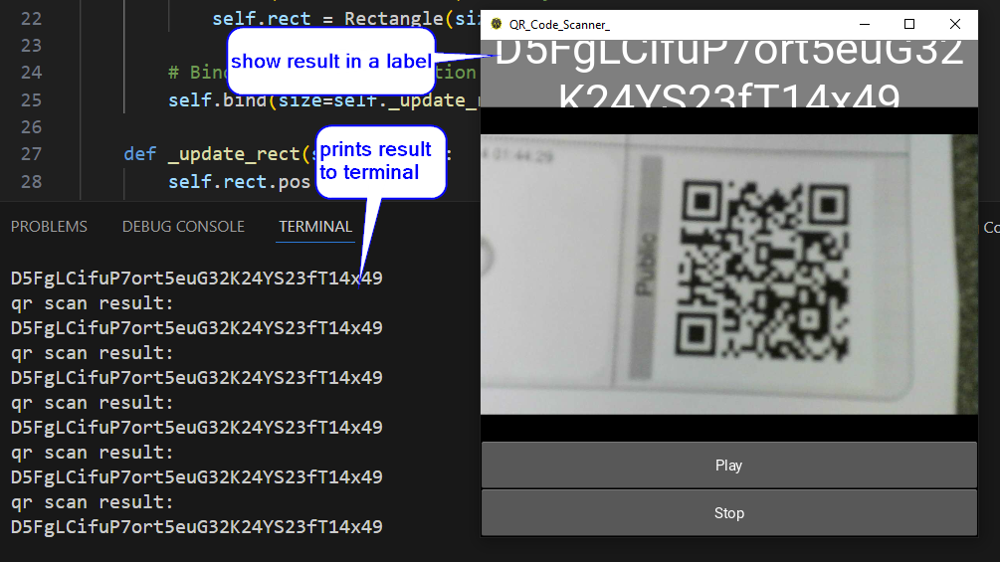
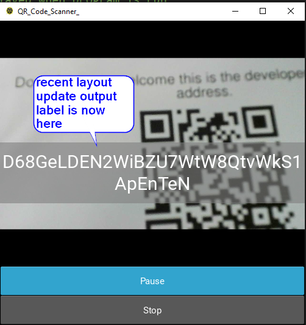

# kivy_QR_Code_Scanner_App
qr code scanner app made with kivy.

to run this app you need to install the requirements.txt
this are the requirements:
kivy
opencv-python
pyzbar

little layout update label is now in the middle:

link to this repo (just for convinience for the developer to quickly open the repo)
https://github.com/Fleischkuechle/kivy_QR_Code_Scanner_App